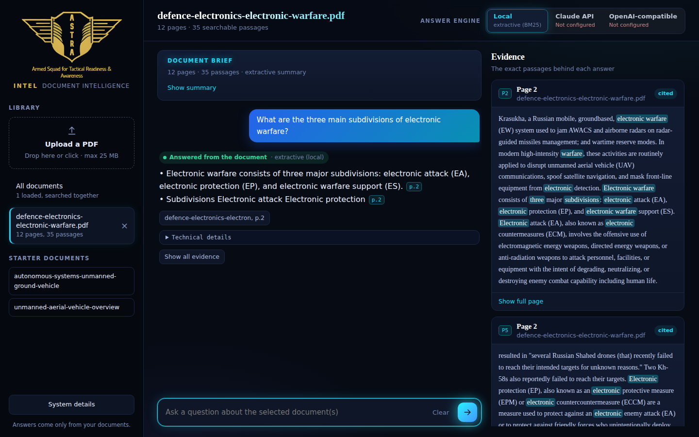
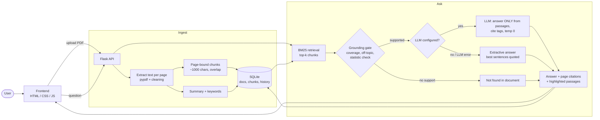

# ASTRA INTEL — Defence Document Intelligence

**Challenge 01 · ASTRA Software Team 3-Day Build Challenge 2026–27**

Upload a defence/technology PDF, get a summary, then ask questions. Every answer is built **only from the uploaded document** and shows the **page it came from**. If the document does not contain the answer, ASTRA INTEL says so instead of guessing.



- **Live demo:** _add your deployed URL here (or delete this line and use the local setup below)_
- **Demo video:** _add link_

## Problem being solved

Defence organisations handle long reports and papers; finding one fact manually is slow, and generic chatbots invent facts. This app lets an analyst ask a document a question and **verify the answer in one click** (page number, highlighted passage).

## Features

**Core (all MUST-HAVEs)**
- Upload PDF (also `.txt` / `.md`), extract text per page
- Concise summary + key topics on upload
- Ask questions; answers use only the document; source page + passage shown

**Additional (SHOULD / BONUS)**
- Web UI: dark neon blue-black theme, sidebar with the ASTRA logo and document library, workspace with conversation, summary brief and an Evidence panel with highlighted source passages; responsive down to mobile
- Error states: corrupt PDF, empty file, scanned/image-only PDF, wrong file type, oversize file, no document uploaded yet, missing API key, LLM failure (falls back automatically)
- Multi-turn chat with visible history; follow-up questions ("Why is it used?") reuse the previous question for retrieval
- Page-level citations (`[p.12]` chips) and matched-word highlighting in source passages; "Show full page"
- Consistent answers: deterministic retrieval + temperature 0
- Multiple documents: ask one document or all together
- Unsupported-answer detection (refuses off-topic and unanswerable questions)
- Conversation persistence (SQLite)
- Runs with **no paid API** (local extractive mode); optional Claude or any OpenAI-compatible/local (Ollama) model
- **Answer-engine selector** in the header: Local / Claude API / OpenAI-compatible. A provider without a key shows **"Not configured"** and cannot be selected; the choice is remembered per browser and applies to answers and summaries
- **Technical details** under every answer (engine, model, stemmed query terms, BM25 scores per passage, grounding-gate tier and coverage, timings) and a **System details** panel (pipeline, library size, provider status)

## Tech stack

| Layer | Choice |
|---|---|
| Backend | Python 3.12, Flask (gunicorn for deploy) |
| PDF extraction | pypdf (+ header/footer stripping, reference-section filtering) |
| Retrieval | Own BM25 implementation (`astra_intel/nlp.py`), light stemmer |
| LLM (optional) | Anthropic Messages API, or any OpenAI-compatible endpoint, via plain HTTPS (`requests`) |
| Storage | SQLite: documents, page-bound chunks, chat history |
| Frontend | Vanilla HTML/CSS/JS (no build step), Fraunces + Inter + JetBrains Mono |

## Architecture



**Data flow.** *Upload:* bytes → SHA-256 dedupe → text per page → remove running headers/footers, URLs, citation markers → chunks that never cross a page boundary (so every citation is an exact page) → summary/keywords → SQLite. *Ask:* question (+ previous question for short follow-ups) → BM25 top-6 passages (plus each document's best passage when searching all documents) → grounding gate → answer → sources with page, highlights and cited/uncited flag → saved to history.

**Why this design.**
- *BM25, not embeddings:* no model download, no GPU, deterministic, and explainable line by line. Trade-off: it misses synonyms (see Limitations). A local embedding model is the first upgrade.
- *Chunks bound to pages:* the challenge requires "show the page"; page-bound chunks make that exact rather than approximate.
- *Gate before the LLM:* refusals should not depend on the model behaving. The gate blocks off-topic questions before any LLM call; the LLM prompt additionally says to reply `NOT_IN_DOCUMENT` if the passages don't contain the answer.
- *LLM is optional:* the app works for any reviewer without keys, and degrades gracefully if the API fails.

## Setup

```bash
git clone <your-repo-url> && cd astra-intel
python -m venv .venv && source .venv/bin/activate      # Windows: .venv\Scripts\activate
pip install -r requirements.txt
cp .env.example .env          # optional: add ANTHROPIC_API_KEY for written answers
python app.py                 # open http://127.0.0.1:5000
```

Windows (PowerShell): `python -m venv .venv`, `.venv\Scripts\activate`, `pip install -r requirements.txt`, `copy .env.example .env`, `python app.py`.
If port 5000 is taken, set `PORT=5001` (PowerShell: `$env:PORT=5001`).

Click one of the ASTRA starter documents on the left (they're in `sample_docs/`) or upload your own.

| Variable | Purpose |
|---|---|
| `ANTHROPIC_API_KEY` | Enables Claude answers/summaries. Default model `claude-haiku-4-5-20251001` (override with `LLM_MODEL`) |
| `LLM_API_KEY`, `LLM_BASE_URL`, `LLM_MODEL` | Any OpenAI-compatible server. Local/free example: Ollama with `LLM_BASE_URL=http://localhost:11434/v1`, `LLM_MODEL=llama3.1` |
| `MAX_UPLOAD_MB`, `ASTRA_DB_PATH`, `PORT` | Optional tuning |

No variables set = only Local mode is selectable; Claude API and OpenAI-compatible show "Not configured" in the selector. API keys are read from environment variables only (never typed into the UI or stored in the database). Restart the server after editing `.env`.

**Deploy (Render / Railway / similar):** build `pip install -r requirements.txt`, start `gunicorn app:app --bind 0.0.0.0:$PORT --workers 1 --threads 4 --timeout 120` (the `Procfile` has this). Add your API key as an environment variable in the host's dashboard, never in the repo. SQLite lives on the instance disk, so data resets when a free host redeploys; sample documents reload in one click.

## AI / ML

- **Retrieval:** Okapi BM25 (k1=1.4, b=0.75) over ~1000-character page-bound chunks, query terms stemmed, stopwords and question-meta words ("document", "discussed") removed.
- **Grounding gate:** IDF-weighted share of query terms found in the best chunk/sentence → `high` / `low` / `none`; also `none` if the question names things absent from the whole corpus (e.g. "FIFA", "France") or asks for a percentage with no matching number in the retrieved text.
- **Answering:** with an LLM: passages are numbered `[P1]…`, the model must cite tags or return `NOT_IN_DOCUMENT`, temperature 0. Without: the best-matching sentences are quoted verbatim with their tags. `low` confidence answers are labelled "closest passages, not a confirmed answer".
- **Summaries:** LLM (first pages + evenly sampled pages, "use only the text") or extractive (definition sentence + highest-weighted sentences spread over pages).
- **No model is trained or fine-tuned.**

## Testing

```bash
pip install -r requirements-dev.txt
python -m pytest -q        # 34 tests, ~20 s, no API key needed
```

Covered: mode selection (unconfigured provider rejected with HTTP 409 and nothing saved; explicit Local ignores a configured key), technical-details payload and persistence, `/api/system`; upload success/duplicate; corrupt, empty, wrong-type and blank (scanned) files; chat before upload; empty/overlong questions; path traversal on the sample endpoint; cited page + highlights; the starter "honesty test" (percentage of autonomous UAV missions → refused); three off-topic questions → refused; repeat-question consistency; history persistence/clear/delete; LLM layer with **mocked HTTP** (request format, citation parsing, `NOT_IN_DOCUMENT`, 401 fallback).

Example (EW sample doc):
- *"What are the three main subdivisions of electronic warfare?"* → "Electronic warfare consists of three major subdivisions: electronic attack (EA), electronic protection (EP), and electronic warfare support (ES). [p.2]"
- *"What percentage of missions are fully autonomous?"* → "Not found in the document"

**Not tested:** live calls to the Anthropic/OpenAI APIs (only mocked), deployment on a hosting provider, very large (100+ page) PDFs, Safari/Firefox.

**Known failure cases**
- Local mode is lexical: it can't match synonyms, and broad or comparative questions ("compare UAVs and UGVs") often return `low confidence` closest passages instead of a synthesis. Use an LLM key for those.
- Questions about a property of a thing the document mentions but never quantifies ("price of the MQ-9 Reaper") can return a low-confidence or unrelated passage in local mode; with an LLM the prompt makes it refuse.
- Text from tables and image captions can be glued into sentences (PDF extraction limit).

## Limitations

- No OCR: scanned/image-only PDFs are rejected with a clear message.
- Single shared library, no login: everyone using one deployment sees the same documents. Don't deploy with private documents.
- Only PDF/txt/md; no docx.
- BM25 only (no semantic search); summary quality in local mode is sentence-picking, not writing.
- Not run against a live LLM in development (see Testing).

## Future improvements

Local embedding model + hybrid search; OCR (Tesseract) for scans; document comparison view; per-user accounts; streaming answers; an evaluation set of question/answer/page triples to measure retrieval recall.

## Attribution

- Sample PDFs: Wikipedia articles (Unmanned aerial vehicle, Electronic warfare, Unmanned ground vehicle), **CC BY-SA 4.0**, supplied in the ASTRA starter pack.
- ASTRA logo/branding: ASTRA starter pack (logo background made transparent). Fonts: Fraunces, Inter and JetBrains Mono (SIL OFL) via Google Fonts.
- Libraries: Flask, pypdf, requests, python-dotenv, gunicorn, pytest.

## AI Usage Disclosure

> **You must edit this block so it is true for you.** Reviewers will ask about it in the discussion.

AI Tools Used:
- Claude

Used For:
- Generating the initial project structure and first drafts of the backend, frontend and tests
- Debugging retrieval/grounding behaviour
- Documentation drafting

Major AI-Assisted Components:
- Flask API, SQLite layer, BM25 retrieval, grounding gate, LLM client, frontend UI

Personally Implemented / Modified:
- _(write what YOU changed, e.g. tuned gate thresholds, changed chunk size, edited the UI, added X)_

Validation:
- Ran the 34 tests; manually asked the 10 starter questions; tried corrupt/empty/scanned files; checked each cited page against the PDF
