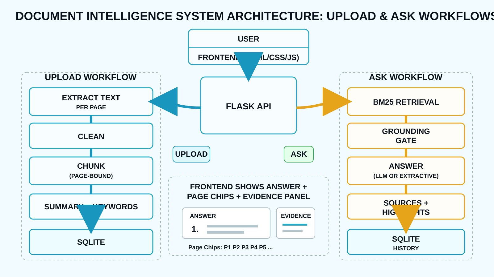

# ASTRA INTEL — Defence Document Intelligence

A Flask-based document intelligence system for uploading PDFs/documents, generating summaries and keywords, and asking grounded questions against the uploaded content.

## Architecture



### Upload workflow
User → Frontend (HTML/CSS/JS) → Flask API → extract text per page → clean → page-bound chunks → summary + keywords → SQLite.

### Ask workflow
Question → Flask API → BM25 retrieval → grounding gate → LLM/extractive answer → sources + highlights → SQLite history → frontend evidence panel.

## Core features

- PDF / text / markdown upload
- Page-aware text extraction and chunking
- BM25 retrieval
- Grounding gate to reduce unsupported answers
- Optional Anthropic / OpenAI-compatible LLM
- Fully local extractive mode when no API key is configured
- Page citations and evidence passages
- SQLite document + chat-history persistence
- Vanilla HTML/CSS/JS frontend

## Run locally

```bash
python -m venv .venv
# Windows
.venv\Scripts\activate

pip install -r requirements.txt
copy .env.example .env
python app.py
```

Open http://127.0.0.1:5000

## Environment variables

See `.env.example`. With no API key, ASTRA INTEL runs in local extractive mode.

## Tech stack

Python 3.12 · Flask · pypdf · BM25 · SQLite · HTML/CSS/JavaScript
